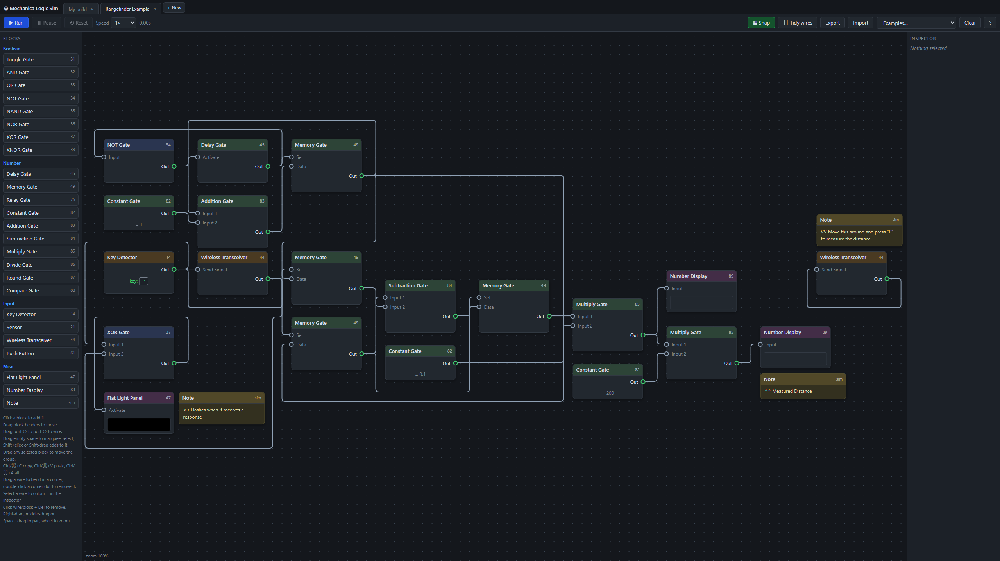

# Mechanica Logic Simulator

[](https://printedscript.github.io/mechanica-logic-sim/src/index.html)

> [!NOTE]
> This project was made for fun to test the capabilities of Claude Fable 5

A web-based visual editor and simulator for designing and testing logic circuits for the [Roblox game Mechanica](https://www.roblox.com/games/6609611538/Mechanica). Build complex logic systems in your browser before implementing them in-game.

## Features

- **Visual Circuit Editor** - Drag-and-drop interface for building logic circuits
- **Tabbed Workspaces** - Keep multiple builds open at once in named tabs; rename them like files (double-click), close them, and each tab autosaves to your browser — including its pan/zoom position
- **Multi-Select & Group Editing** - Rubber-band drag to select many blocks (Shift to add), or Shift/Ctrl-click to toggle individual blocks. Drag any selected block to move the whole group together, keeping wire layouts relative to their blocks
- **Copy & Paste** - Copy, cut, and paste blocks (Ctrl/⌘+C / X / V) with their internal wiring preserved. The clipboard is shared across tabs, so you can paste a selection into any other tab
- **Real-time Simulation** - Test your circuits with adjustable simulation speed (0.25× to 10×)
- **Complete Block Library** - All Mechanica logic blocks including:
  - Boolean logic gates (AND, OR, NOT, NAND, NOR, XOR, XNOR)
  - Number operations (Add, Subtract, Multiply, Divide, Round, Compare)
  - Memory and delay gates
  - Input blocks (Key Detector, Sensor, Push Button, Wireless Transceiver)
  - Output blocks (Flat Light Panel, Number Display)
  - Sticky **Note** blocks for documenting builds (simulator-only)
- **Smart Wire Routing** - Auto-tidy feature to organize wire layouts, plus draggable wire corners
- **Wire Colours** - Colour-code any wire; coloured wires glow in their own colour when carrying a True value
- **Grid Snapping** - Optional snap-to-grid for precise block placement
- **Flexible Panning** - Pan with right-drag, middle-drag, or Space + drag; scroll to zoom
- **Import/Export** - Save and load your circuit designs
- **Example Circuits** - Pre-built examples to learn from:
  - Key → Toggle → Light
  - Blinker (NOT + Delay loop)
  - Counter (Memory + Add)
  - Rangefinder (wireless echo)

## Getting Started

### Access from Github Pages
[Click Here](https://printedscript.github.io/mechanica-logic-sim/src/index.html) to be redirected to the Github hosted page.

### Running Locally

1. Clone this repository
2. Open `src/index.html` in a modern web browser
3. Start building your logic circuits!

No build process or dependencies required - it's a pure JavaScript application.

### Basic Usage

1. **Add Blocks** - Click blocks from the left palette to add them to the canvas
2. **Move Blocks** - Drag block headers to reposition them
3. **Connect Blocks** - Drag from one port (⭘) to another to create wires
4. **Wire Corners** - Drag a wire segment to create corner points; double-click corner dots to remove them
5. **Configure Blocks** - Select a block and use the Inspector panel on the right to adjust properties (it also shows the block's canvas position, live while you drag)
6. **Run Simulation** - Click "▶ Run" to start simulating your circuit
7. **Navigate** - Right-drag, middle-drag, or hold Space and drag to pan; use the mouse wheel to zoom

### Working with Multiple Blocks

- **Select many** - Drag across empty canvas to rubber-band select every block the box touches. Hold **Shift** while dragging to add to the current selection, or **Shift/Ctrl-click** a block to toggle it. **Ctrl/⌘+A** selects everything
- **Move a group** - Drag any selected block and the whole selection moves together, keeping each block's spacing. Wires between two selected blocks keep their corners in place relative to the blocks
- **Copy & paste** - **Ctrl/⌘+C** copies the selection, **Ctrl/⌘+V** pastes it (offset so it doesn't cover the originals), and **Ctrl/⌘+X** cuts. Wires between copied blocks are preserved; wires to blocks that weren't copied are dropped. The clipboard is shared across tabs

### Tabs

- Each tab is a separate build. Click **+ New** for a blank one, or click a tab to switch to it
- **Double-click a tab** to rename it (Enter confirms, Esc cancels); the **×** closes it (you're asked first if it isn't empty)
- Every tab autosaves to your browser — its blocks, wires, and pan/zoom are restored when you return. Import, Export, and Clear act on the current tab

### Controls

- **Run/Pause/Reset** - Control simulation playback
- **Speed** - Adjust simulation speed from 0.25× to 10×
- **Snap** - Toggle grid snapping for blocks and wires
- **Tidy Wires** - Automatically route all wires neatly
- **Export/Import** - Save and load circuit designs as JSON
- **Clear** - Remove all blocks and wires from the current tab
- **Delete** - Select a block or wire and press Delete/Backspace to remove it (clears the whole selection at once)
- **Wire colour** - Select a wire and pick a colour in the Inspector

## How It Works

The simulator replicates Mechanica's event-based logic system:

- All data is represented as numbers
- Boolean values: `> 0.5` is **True**, `≤ 0.5` is **False**
- Boolean gates output exactly `1` (true) or `0` (false)
- When a block's output changes, it propagates updates to connected blocks
- The simulator includes loop detection to prevent infinite update chains
- "Nothing" values (unconnected ports) are handled like in-game

For detailed block behavior and properties, see [DOC.md](DOC.md).

## Project Structure

```
mechanica-logic-sim/
├── src/
│   ├── index.html          # Main HTML structure
│   ├── style.css           # Application styles
│   ├── blocks.js           # Block type definitions and logic
│   ├── engine.js           # Simulation engine
│   ├── editor.js           # Visual editor and interaction
│   ├── route.js            # Wire routing algorithms
│   ├── clipboard.js        # Portable copy/paste clipboard (shared across tabs)
│   ├── app.js              # Application initialization, tabs, and workspace
│   └── build_examples.js   # Pre-built example circuits
├── imgs/
│   └── preview.png         # Preview image
├── DOC.md                  # Detailed block behavior documentation
└── README.md               # This file
```

## Links

- [Mechanica on Roblox](https://www.roblox.com/games/6609611538/Mechanica)
